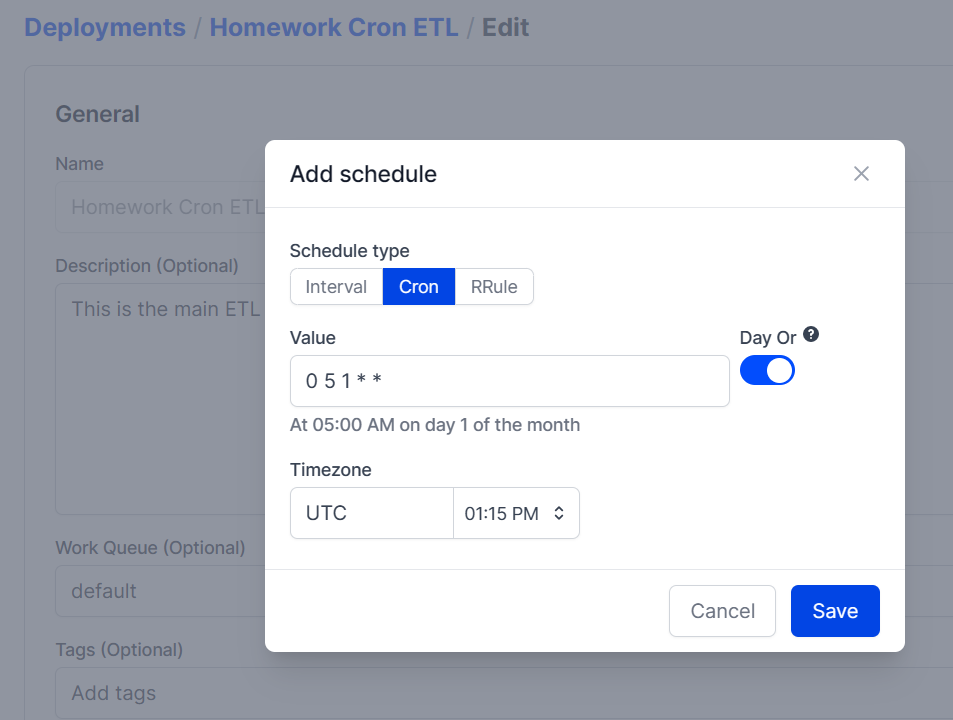

## Week 2 Homework

## Question 1. Load January 2020 data
Using the etl_web_to_gcs.py flow that loads taxi data into GCS as a guide, create a flow that loads the green taxi CSV dataset for January 2020 into GCS and run it. Look at the logs to find out how many rows the dataset has.

How many rows does that dataset have? **447770**
```
print(f"rows: {len(df)}")
```
## Question 2. Scheduling with Cron
Cron is a common scheduling specification for workflows.

Using the flow in etl_web_to_gcs.py, create a deployment to run on the first of every month at 5am UTC. What’s the cron schedule for that? ``` 0 5 1 * * ```

```
prefect deployment build deployment_etl_to_gcs.py:etl_web_to_gcs -n "Homework Cron ETL" --cron "0 5 1 * *" -a
```



## Question 3. Loading data to BigQuery

-> The main flow should print the total number of rows processed by the script. Set the flow decorator to log the print statement.
```
@flow(log_prints=True)
```

-> Parametrize the entrypoint flow to accept a list of months, a year, and a taxi color.
```
prefect deployment build etl_gcs_to_bq.py:etl_gcs_to_bq -n "Homework Parameterized" --params={ "color": "yellow", "months": [2, 3], "year": 2019}

```